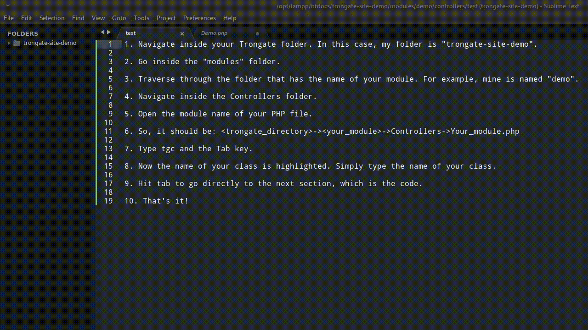

# Read Me

## Smitty's Snippets for the Trongate framework

## About these snippets

### All developers

These snippets make it faster and easier to use the Trongate Framework. This is important for developers who want their work done in faster time.

The Trongate website is at [Trongate website](https://trongate.io).

The Trongate framework can be downloaded on Github at [Trongate framework](https://github.com/davidjconnelly/trongate-framework)

These snippets are to make life easier and faster then before using the Trongate framework. For sure, this will create a better experience and workflow.

### Speed Coding Academy

As a founding member at Speed Coding Academy,
with Trongate, companion tools, and these snippets, there is no doubt you can create anything at lightning fast feeds!

Of course, recommendations are always appreciated inside the forum, if you would like some improvements. Folks at the academy, these are your passports to having keys to a operating at jet speeds!

When you use these snippets with Sublime Text within HTML Files, or HTML within PHP, simply use the less than sign(<). As soon you start typing, it will display all the snippets. If it is directly within PHP itself, it should automatically show all of the Trongate Snippets as soon as you type. There is now a VSCode extension thanks to Simon and Jake:

[Jake and Simon's VSCode Extension](https://marketplace.visualstudio.com/items?itemName=jc-sf.trongate)

## Prerequisites

-   [Trongate framework](https://github.com/davidjconnelly/trongate)

## Installation

### Windows

Copy snippet files to %APPDATA%/Sublime Text 3/Packages/Sublime Text 3 Snippets

### MacOSX
Copy snippets files to ~/Library/Application Support/Sublime Text 3/Packages/Sublime Text 3 Snippets

### Linux
Copy snippet files to ~/.config/sublime-text-3/Packages/Sublime Text 3 Snippets

## Usage

## Built With

-   [Sublime Text](https://www.sublimetext.com)
-   [Atom](https://atom.io)

## Other news

Once the time is ripe, there are upcoming lessons, so stay tuned for that!

And for a more comprehensive view of the HTML snippets and ones I'm transferring to this Github account:

[Smitty's Trongate Snippets in HTML](https://www.stevenmilley.com/sca/tg-snippets/sublime/readme.html)

## Acknowledgments

-   [Speed Coding Academy](https://www.speedcodingacademy.com)
-   [Trongate](https://trongate.io)
-   [David Connelly](https://www.youtube.com/channel/UCtsojFV90CDh7uABAssuITw)
-   Simon, our Speed Coding "GodFather"
